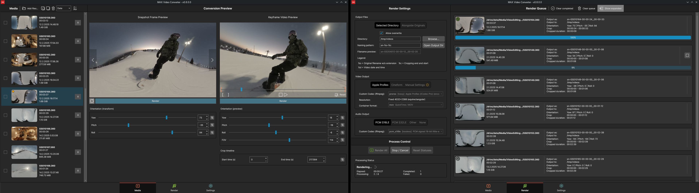
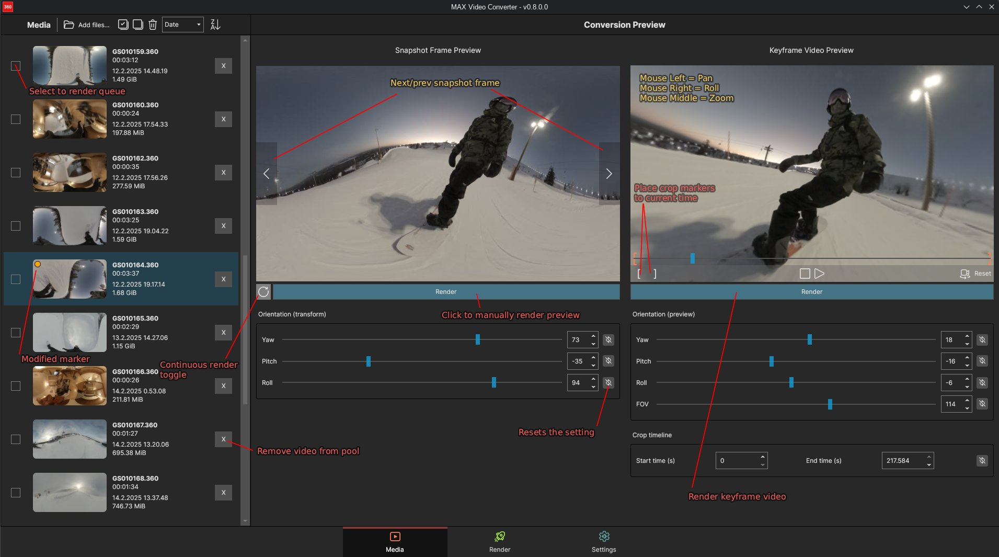
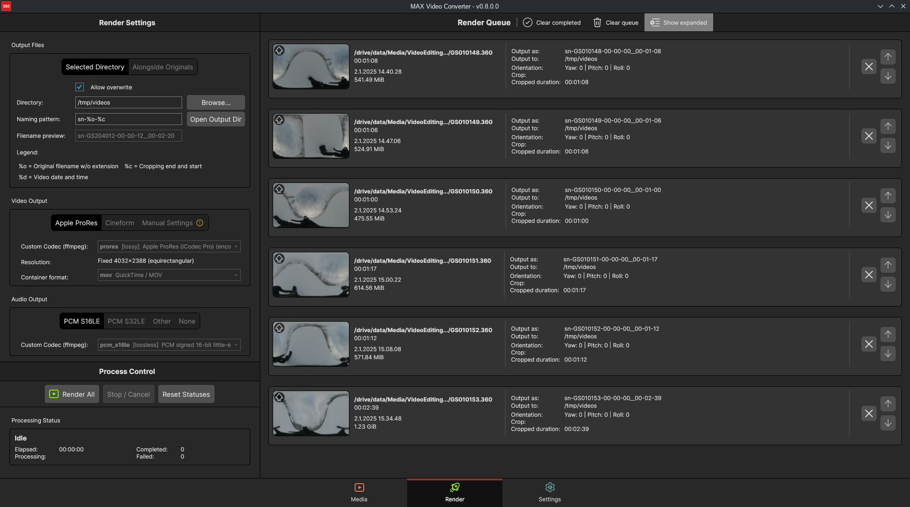

# MAX Video Converter - GoPro MAX .360 video conversion tool for Linux

### Go to **[Releases](https://github.com/Jusas/gopromax-conversion-tools/releases)** for the downloads

Available as a **.deb package** (recommended) and as an **AppImage**.



### Not sure how to use? [Hop over to instructions!](#usage-instructions)

## What is it? 

As you probably know by now, GoPro doesn't prioritize Linux users in any way. This means that while their GoPro Player
runs on Windows and Mac, they provide nothing workable for Linux. Since the GoPro player is so well tied to Windows Store and such,
it's not really possible to get it running in Wine either. So we're left to our own devices (literally).

As a GoPro MAX owner and a Linux user, I needed something to at least fulfill my basic needs to convert the 360 videos to
a workable format. That's how this application was concieved.

Thus, **MAX Video Converter** was born - it is a GUI application meant to rectify all these shortcomings at least a little bit.
It's designed to run specifically in Linux, but it's built with [Avalonia UI](https://avaloniaui.net/) so theoretically you should be able to run it in
Windows and Mac as well, when built for those platforms. They are not the priority for this application however, since GoPro 
already caters for Windows and Mac users.

## What can it do?

It's designed for previewing and converting your videos in bulk, from the GoPro custom 360 format to the more standard equirectangular format. The general workflow is this:

- Add your videos to the media pool
- You can preview each video, how it looks in the standard equirectangular mode with a few preview snapshot frames extracted from the video
- Edit the rotation parameters so that most of your video is aiming in the right direction (fixing/avoiding the nasty gimbal locks)
- Quick-render and preview the video (a keyframe-preview only, so it's relatively fast) and view it in the player as a true 360 video
- Crop start and end of the video while you're at it, to avoid wasting time on rendering parts that you are going to cut out anyway
- Finally, select your render settings and render your videos to the standard equirectangular 360 video format, which can be used and reframed in video editors like DaVinci Resolve for example

See this example video on how to use, step by step:

[ VIDEO PLACEHOLDER ]

## How it does its thing

They key elements at play are:

- ffmpeg, for the video conversion using custom filters (this is what does the magic)
- exiftool, for writing the necessary video tags
- libvlc, for the 360 video preview
- Avalonia UI for the graphical user interface


# Current version notes

This is far from a perfect solution, but it is something that at least works on some level.

Current limitations/issues are:

- Currently only supports the 5.6K resolution 360 videos (don't know why anyone would want anything less)
- Outputs the default audio stream (not ambisonic)
- No kind of keyframing tools (likely never will be)
- No stabilization of any kind (likely never will be)
- The VLC video preview is somewhat quirky; scrubbing may sometimes fail, and clicking play/stop/pause might be needed to get it to behave again.
- No GPU acceleration, all work is done on CPU

There aren't many validations or extensive error handling, consider it a "beta". I'm also assessing whether or not to spend time on this project - if there is any interest in it. Expect some bugs here and there.

Stabilization is an interesting subject but I'm afraid I probably do not have enough time to dive into it. There are some interesting experiments on the subject though (see the links at the end).


# Usage instructions

Using the application is pretty simple and hopefully somewhat intuitive.

## Prerequisites
First off, you will need to have [ffmpeg](https://ffmpeg.org/) installed in order for the application to do anything meaningful. It will let you know on startup if ffmpeg can't be found.

***Note:** In the .deb package it is declared as a dependency and will be automatically installed from apt.*

Most Linux distros have it packaged and ready to install, consult your distro's package manager. If you're running Ubuntu or its derivatives, just run:

```
sudo apt install ffmpeg
```

The app also uses [Exiftool](https://exiftool.org/) but in the AppImage release it's bundled together. However if you already have it installed and can be found from your `PATH`, it will be used automatically.

***Note:** In the .deb package it is declared as a dependency and will be automatically installed from apt.*

## Basic usage

Most of the time will be spent on the preview screen. The usage is mostly pretty clear, but here's a quick annotation of the controls:



The main tools here are the _"snapshot frames"_ and the _"keyframe video preview"_.

Snapshot frames are simply individual frames snapped from the video at various points in time. They're the quickest preview you can get. The image is shown in the equirectangular projection (i.e. what it will render the output in).

Choose a frame that represents your "main posture". **The goal here is to tweak the orientation so that your main subject is in the center of the frame, the right way up.** 
I usually toggle the "continuous render" on and just tweaks the sliders until it starts to look correct. 
This will make the video much easier to work with, as in mostly avoiding the nasty gimbal locks that are present when dealing with yaw/pitch/roll rotations.

Once you're somewhat happy with it, you can render the keyframe video and see the result.

The keyframe video is, as the name implies, a quickly generated preview with only the video's keyframes rendered. It's effectively a ~1 FPS slideshow but is good enough, and doesn't take insanely long to render.

Finally when you're happy with the result, you can crop the video start/end now that you're already previewing it, and to not waste rendering time on stuff that you'll be cutting out anyway.

Once done, make sure you select the videos that you want to render on the media pool. You'll also see a small yellow marker on the videos that you've tweaked.

## Rendering



A few notes about rendering:

- Select your output folder, and your naming pattern
  - Note: it won't try to overwrite your .360 videos, even if you choose the same folder
- The recommended codecs are auto-selected already but it's possible to choose other codecs as well, and change the output resolution - however there are no guarantees how well different codecs work, and there's also limitations on what containeres exiftool can tag - so you may try, but don't expect too much. This feature exists just in case there's the need for it.
- If you don't need the audio, you can just choose "None"
- Render queue order can be tweaked from the buttons

It's pretty simple.

## Settings

The settings can be tweaked if need be.

The executable paths for Exiftool, ffmpeg and ffprobe can be set. If you change these, please restart the application.

_Note: The downloadable AppImage comes with exiftool bundled by default, but not ffmpeg._
Any user installed binaries will override the bundled ones.

The preview settings can be tweaked, if you want more snapshot frames to be generated for example.

Logs are also written, and in case something odd is going on you may try to increase the logging level to more verbose to see what may be going on.


# Additional credits

Credit goes to [slackspace-io](https://github.com/slackspace-io) for their [gopro-max-video-tools](https://github.com/slackspace-io/gopro-max-video-tools) script that does the heavy lifting in the conversion process. The ffmpeg filter used by this application is nearly the same, with slight modifications.

# Useful and interesting links on the subject

- https://gopro.github.io/gpmf-parser/
- https://gopro.com/en/se/news/max-tech-specs-stitching-resolution
- https://ffmpeg.org/ffmpeg-filters.html#Examples-131
- https://github.com/eltorio/MaxToEquirectPlugin
- https://www.trekview.org/blog/calculating-heading-of-gopro-video-using-gpmf-part-3/
- https://www.trekview.org/blog/using-gpano-gspherical-metadata-adjust-roll-pitch-heading/
- https://www.trekview.org/blog/roll-level-of-gopro-photo-no-gpmd-part-1/
- https://www.youtube.com/watch?v=04WLGxfqC3g

